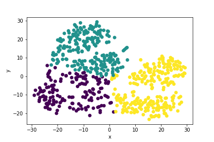

# myopia-clusters

### Approach
With this project I had to determine how many, if any, clusters there are in a given dataset. Because the dataset included a large number of features, I used two methods of reduction so I could easily visualize the results once acquired.

### Methods
I first had to remove the output from the given dataset to avoid overtraining the model. Afterwards I used `StandardScaler` to standardize the values of the given dataset. In order to reduce the feature number I used a `90%` PCA variance and a t-SNE learning rate of `35`. One the feature number was down to two, I graphed it to verify its form then ran a test to check for the optimal `kNN` value. This value was found to be `3`. From there it was a simple matter of training the dataset based on 3 neighbors in `KMeans` model.

### Output
The resulting graph (above) from the KMeans clustering confirmed the model's accuracy. It is reasonable to say there are 3 distinct groups within the given dataset.